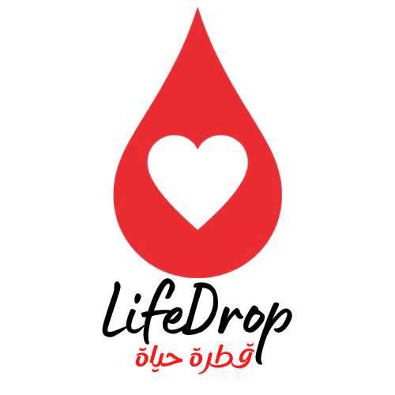

<p align="center">
  
</p>
<p align="center">
A full-stack blood donation platform connecting donors with hospitals in real time to save lives faster and more efficiently.
</p>
<p align="center">
(وَمَنْ أَحْيَاهَا فَكَأَنَّمَا أَحْيَا النَّاسَ جَمِيعًا )
<br>
صدق الله العظيم
</p>

---

## 📌 Overview

**LifeDrop** is an intelligent blood donation management system designed to bridge the gap between blood donors and hospitals during urgent situations.

The platform enables hospitals to request blood donations instantly, while matching eligible nearby donors in real time.

---

## 🏗️ System Modules

LifeDrop consists of three main components:

- 📱 **Donor Web Application**
- 🏥 **Hospital Web Dashboard**
- 🛠️ **Admin Control Panel**

---

## 🚀 Features

### 👤 Donor Application

- User registration with medical details
- Blood type selection
- Location-based hospital matching
- Real-time donation request notifications
- Donation status tracking
- Donation history
- Viwe User profile 

---

### 🏥 Hospital Dashboard

- Hospital registration & verification
- Blood inventory management
- Create urgent blood donation requests
- Track available donors
- Real-time Notification

---

### 🧑‍💼 Admin Panel

- Approve / reject hospital registrations
- Manage donors and hospitals
- Monitor donation activity
- System analytics dashboard

---

## 🛠️ Tech Stack

### Frontend
- React.js
- Tailwind CSS
- Material Tailwind
- React Router

### Backend
- Node.js
- Express.js

### Database
- MySQL / Firebase

---

## ⚙️ Installation & Setup

### 1. Clone the Repository

```bash
git clone https://github.com/eman-sabry/Blood-Donation.git
cd Blood-Donation
```

### 2. Run Frontend

```bash
cd FrontEnd
npm install
npm run dev
```

### 3. Run Backend

```bash
cd Backend
npm install
npm run dev
```

---

## 👩‍💻 My Contribution

- Designed and developed responsive user interfaces
- Built donor and hospital dashboards
- Implemented authentication workflow
- Developed blood request management system
- Integrated real-time notification logic

---


## 🌍 Project Goal

LifeDrop aims to reduce blood donation response time and improve communication between donors and hospitals to help save more lives.

---

⭐ If you found this project helpful, feel free to star the repository.